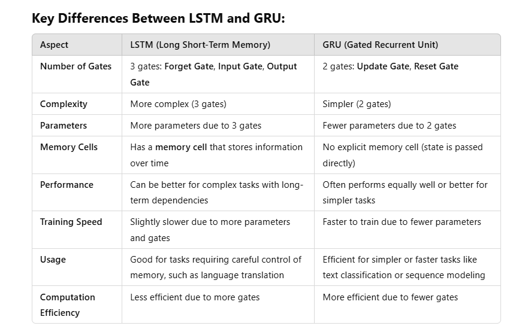

What is GRU (Gated Recurrent Unit)?
GRU is a type of Recurrent Neural Network (RNN), similar to LSTM (Long Short-Term Memory). It was introduced in 2014 by Kyunghyun Cho and his collaborators. GRU is designed to solve the same problem as LSTM: the vanishing gradient problem in traditional RNNs, allowing the network to better capture long-term dependencies in sequential data (like text, speech, or time-series data).

How GRU Works:
GRU is a simplified version of LSTM with fewer parameters. It has two main gates instead of three, making it computationally more efficient while still performing well on sequential data tasks.

Update Gate: Decides how much of the past information (previous state) should be passed along to the future. It controls how much memory to retain.

Reset Gate: Decides how much of the past information to forget when computing the current state. It helps the model decide whether to rely on the previous memory or "reset" it.

When and Why was GRU Developed?
GRU was developed in 2014 as a more computationally efficient alternative to LSTM. While LSTM provides a more robust solution to the vanishing gradient problem, it comes with more complexity due to its three gates (input, output, and forget gates). GRU reduces this complexity by using only two gates (update and reset), which makes it easier and faster to train while still achieving similar performance in many cases.

GRU vs LSTM:
LSTM has three gates (input, output, and forget), which means it has more parameters and can be slower to train.
GRU has two gates (update and reset), making it simpler and faster in some cases but still very effective for learning long-term dependencies.
Where is GRU Used?
GRU is used in many of the same areas as other types of RNNs, particularly for tasks involving sequential data. Some common applications include:

Natural Language Processing (NLP):

Text generation: Used in models like chatbots, automatic text completion, and story generation.
Sentiment analysis: For classifying whether a piece of text is positive, negative, or neutral.
Machine Translation: Translating text from one language to another.
Speech Recognition:

GRU is used in speech-to-text systems where sequential audio data is transformed into text.
Time Series Prediction:

Used for predicting future values based on past time-series data, such as in stock market prediction, weather forecasting, or energy demand prediction.
Music Generation:

In music generation models, GRUs are used to generate new music sequences by learning patterns from existing music data.
Video Processing:

In tasks like action recognition or video classification, where the model needs to learn from a sequence of frames over time.
Why Use GRU?
Efficiency:

GRUs are computationally more efficient than LSTMs because they have fewer parameters (due to fewer gates), which speeds up training.
Good Performance with Less Complexity:

In many tasks, GRUs perform nearly as well as LSTMs, but with a simpler structure, making them a good choice when computational resources are limited.
Solving Long-Term Dependencies:

Like LSTM, GRU solves the vanishing gradient problem, allowing the model to retain information over long sequences.
Example Use Cases:
Language Models: GRUs can be used in language modeling tasks where the model predicts the next word in a sentence based on previous words.
Sentiment Analysis: GRUs are useful in analyzing text data to determine whether a review or tweet expresses a positive or negative sentiment.
Stock Price Prediction: GRUs can be applied to time-series data, like predicting stock prices based on past data trends.
In Summary:
GRU is a type of RNN that was introduced in 2014 as a simpler alternative to LSTM, designed to retain important information in sequences while being computationally more efficient.
It uses two gates: the update gate and the reset gate, making it faster and less complex than LSTM.
GRU is widely used in applications such as NLP, speech recognition, time-series prediction, and music generation.
Would you like more detailed information on how GRU is implemented or an example code?

LSTM vs GRU: Differences and Common Points
Both LSTM (Long Short-Term Memory) and GRU (Gated Recurrent Unit) are advanced types of Recurrent Neural Networks (RNNs), designed to solve the vanishing gradient problem and help the model capture long-term dependencies in sequential data. They are both useful in tasks involving time series, text, speech, etc., but they differ in structure and complexity. Here’s a comparison of the key differences and similarities between LSTM and GRU:

lstm+gru custom model types
Sequential Model: Stack LSTM and GRU layers in sequence.
Reversed Model: Start with GRU followed by LSTM.
Bidirectional Model: Use Bidirectional LSTM followed by GRU or vice versa to capture dependencies in both directions.
Parallel Model: Use both LSTM and GRU in parallel and combine their outputs for richer feature representation.